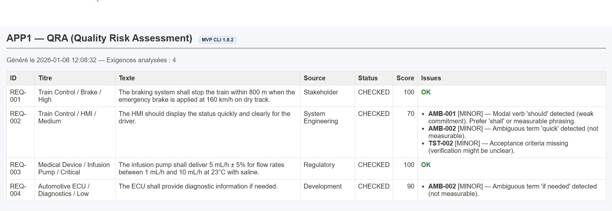

# APP1 — QRA (Quality Risk Assessment) — Requirements Quality Assistant

## TL;DR — Démo en 1 phrase
Outil d’analyse qualité d’exigences (type DOORS / Polarion) qui détecte automatiquement les défauts
(ambiguïté, testabilité, critères d’acceptation) et génère un rapport HTML démontrable avec IA optionnelle et non décisionnelle.

**But :** accélérer et fiabiliser la revue qualité d’exigences grâce à un **pipeline outillé** :
- détection de défauts via **règles déterministes**
- suggestions **optionnelles** via IA
- génération d’outputs démontrables (CSV + HTML)

> IA = **suggestion only** (jamais décisionnelle).
> L’application fonctionne **sans IA** par défaut.

---

## Problème métier
La revue d’exigences est souvent :
- longue et manuelle
- hétérogène (styles variables)
- sujette aux ambiguïtés et défauts de testabilité
- difficile à démontrer rapidement en entretien

## Valeur apportée
- **Standardisation** : score qualité + issues typées par exigence
- **Gain de temps** : pré-filtrage automatique des défauts récurrents
- **Traçabilité V&V** : règles explicites, tests unitaires, décisions auditables
- **Démo portfolio** : aperçu immédiat (PNG) + rapport HTML consultable sans exécution

---

## Fonctionnement (pipeline résumé)

1) **Entrée**  
   CSV d’exigences (format proche DOORS / Polarion)

2) **Analyse déterministe**  
   Règles qualité (ambiguïté, testabilité, critères d’acceptation)

3) **IA (optionnelle)**  
   Suggestions textuelles d’amélioration (non décisionnelles)

4) **Sorties**
   - Rapport CSV (audit)
   - Rapport HTML (consultable)
   - Revue humaine finale

> L’IA est **optionnelle**, **non bloquante**, et **n’influence jamais le score**.

---

## Installation (local)

```bash
python -m venv venv
# Windows PowerShell:
venv\Scripts\activate
python -m pip install -U pip
python -m pip install -e .
python -m pip install -r requirements.txt
```

## Tests (CI-friendly)
```bash
pytest -vv
```

---

## Quickstart

### Option A — Démo sans exécution (portfolio)

Cette option correspond à une démonstration “portfolio” :
les résultats sont figés, reproductibles, et identiques à une exécution locale.

Aperçu du rapport (PNG) :



Rapport HTML de démonstration :
- `docs/outputs_demo/qra_output_demo.html`

Note :
- GitHub n’affiche pas le rendu HTML.
- Le PNG ci-dessus montre le rendu réel du rapport.
- Le fichier HTML reste la référence interactive hors GitHub.

### Option B — Reproduire localement (sans IA, recommandé pour démonstration déterministe)

Cette option correspond au mode nominal de l’outil (100 % déterministe).

```bash
python -m vv_app1_qra.main --verbose
```

Génère automatiquement :
- `data/outputs/qra_output_<timestamp>.csv`
- `data/outputs/qra_output_<timestamp>.html`

Ouvrir le fichier HTML généré dans un navigateur.

### Option C — Mode IA (optionnel, avancé)

```powershell
$env:ENABLE_AI="1"
$env:OPENAI_API_KEY="your_key_here"
python -m vv_app1_qra.main --verbose
```

> L’IA fournit uniquement des suggestions textuelles.
> Elle ne modifie ni le score ni le statut des exigences.

---

## Structure du projet

```text
vv-app1-qra/
├─ src/
│  └─ vv_app1_qra/
├─ tests/
├─ data/
│  └─ inputs/
├─ docs/
│  └─ outputs_demo/
└─ README.md
```

