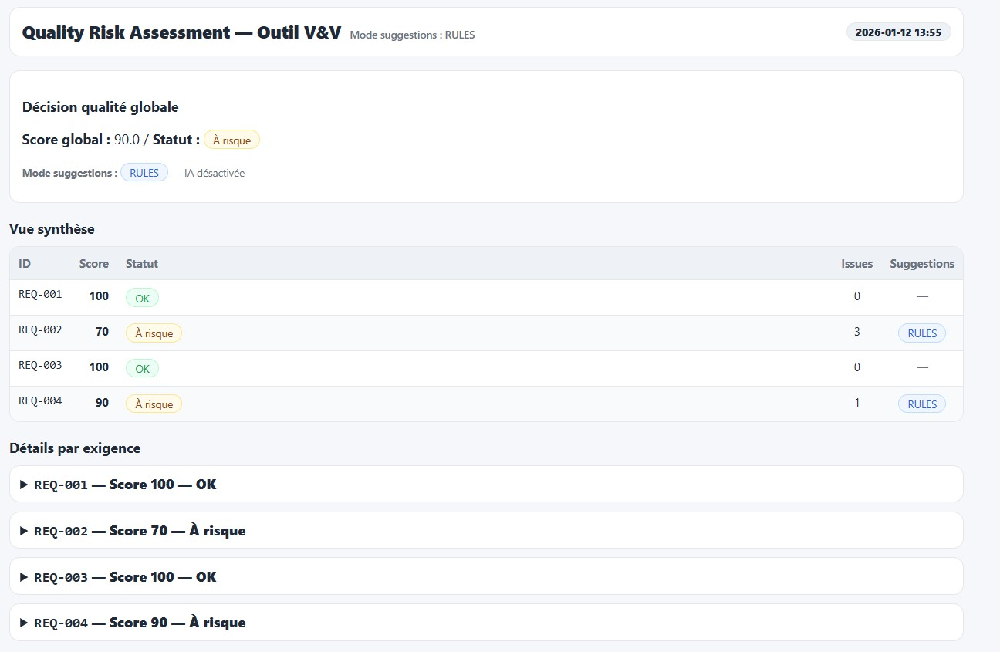
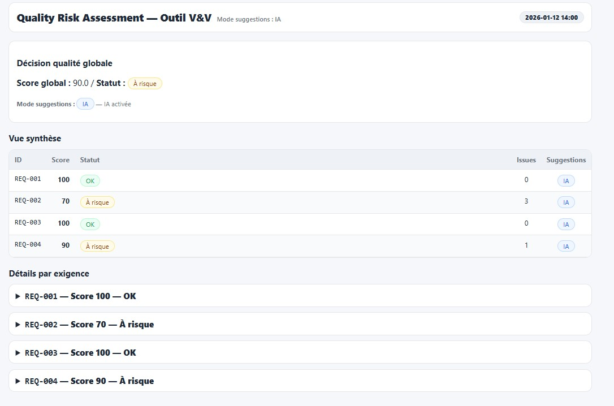

# APP1 — QRA — Walkthrough de démonstration

## Objectif

Guider une démonstration **claire, reproductible et maîtrisée**
de l’outil APP1 — QRA, en contexte entretien ou audit.

Ce walkthrough permet :
- d’adapter la démo au temps disponible
- de répondre sereinement aux questions
- d’éviter toute dérive technique inutile

---

## Étape 1 — Démo sans exécution (recommandée en entretien)

Cette étape permet de montrer la valeur de l’outil
**sans dépendance à l’environnement technique**.

### Action

1 Sans IA
Ouvrir le fichier : demo/assets/outputs_no_ai/rapport.html
ou l'aperçu du rapport (JPG) : 

2 Avec IA
Ouvrir le fichier : demo/assets/outputs_ai/rapport.html
ou l'aperçu du rapport (JPG) : 


### À montrer

- score global et statut qualité
- table de synthèse des exigences
- détail d’une exigence avec ses issues

**Chaque exigence est analysée indépendamment, à partir de règles explicites et traçables.**

### À éviter

- expliquer l’implémentation technique
- commenter le code
- entrer dans les règles une par une

---

## Étape 2 — Exécution locale (optionnelle)

À utiliser si le recruteur souhaite voir le fonctionnement réel du pipeline.

### Commande

```bash
python -m vv_app1_qra.main --verbose
```

Résultats générés
- CSV de synthèse dans data/outputs/
- rapport HTML local

**Le rapport est généré automatiquement et reflète l’état courant du moteur déterministe.**

À montrer
- rapidité d’exécution
- cohérence avec le rapport de démonstration

À éviter
- lire les logs
- expliquer chaque module

---

## Étape 3 — IA optionnelle (uniquement si demandé)

Cette étape est facultative et ne doit être montrée que si la question est explicitement posée.
```powershell
Activation
$env:ENABLE_AI="1"
$env:OPENAI_API_KEY="your_key_here"
python -m vv_app1_qra.main --verbose
```

À montrer
- suggestions IA clairement identifiées
- scores et statuts inchangés

**L’IA ne décide rien.Elle suggère, l’humain décide.**

## Conclusion

APP1 — QRA est un outil :
- déterministe par conception
- traçable et audit-ready
- IA maîtrisée et non décisionnelle

**👉 L’ingénieur V&V reste responsable de la décision.**
**👉 L’outil apporte structure, cohérence et démonstrabilité.**